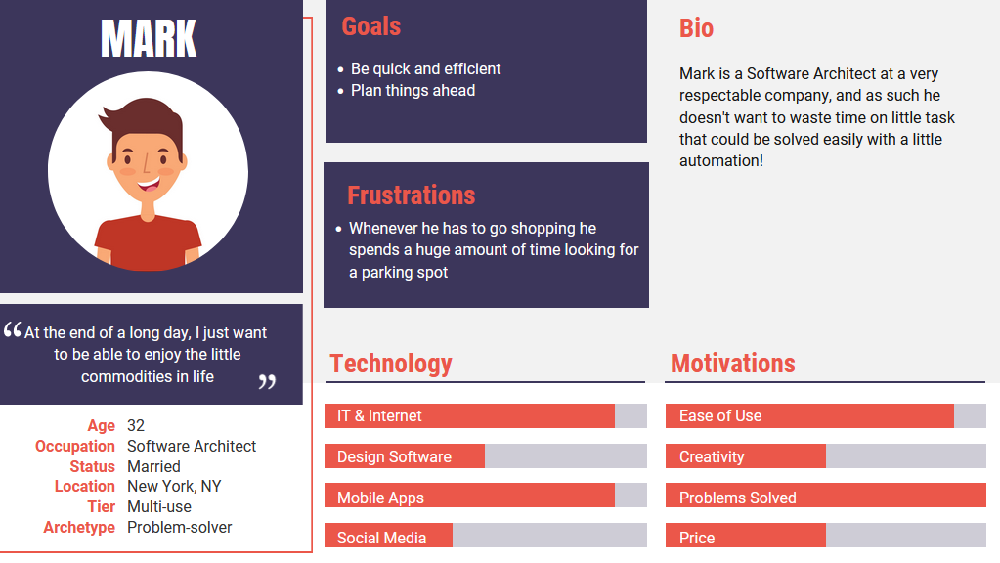
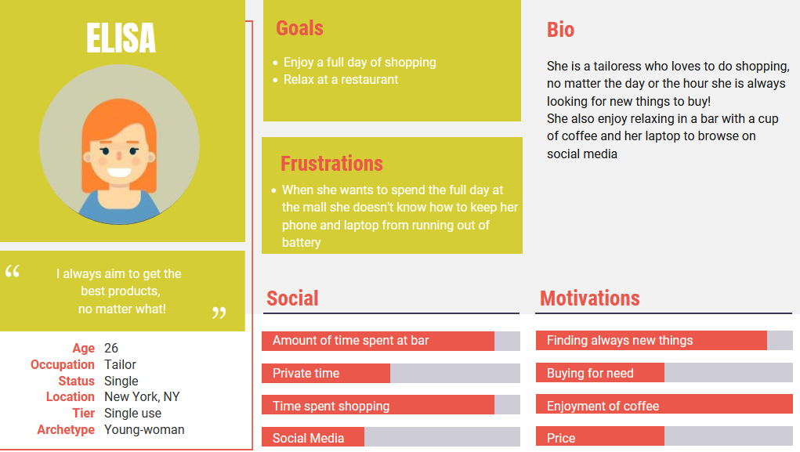
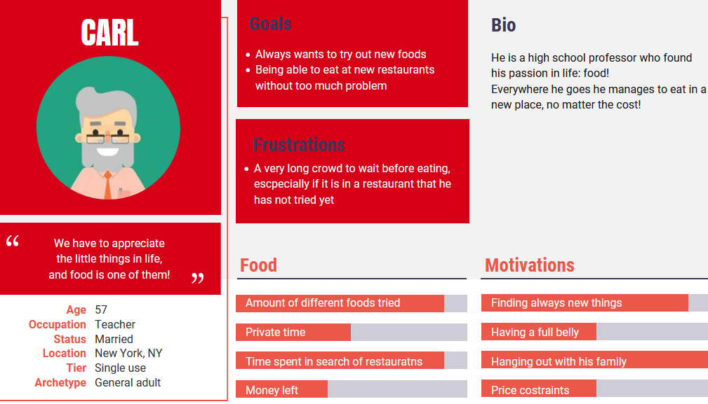

# Concept

# SBIM
## What is SBIM? 
Smart Building Interactive Map is an idea envisioned to renew the concept of traversing a building. 

Entering into the building, a person can easily access a web page in which he will find the the map of the edifice with all its locations. More than helping people to orientate in the structure, the map is also completely interactive giving the possibility to click on rooms and location to have informations about them. In particular the user can easily check the level of crowding of a specific room with an intuitive visualization of how much it is frequented at the moment. The application aim to reduce the waste of time searching for a free work/study space, providing a real-time estimation of the room's occupancy in the building.
The way in which the application is concerned, make it be also a good tool to collect data about the the social frequentation of the building and to monitor the crowding level of its rooms.

## User stories

