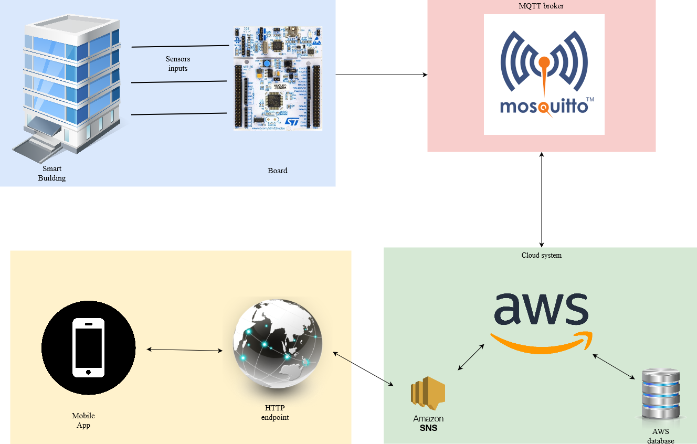

# Technology

Our high level design is composed of:

# BOARD

The board we intend to use is the [Nucleo-64 STM32F401](https://www.st.com/en/evaluation-tools/nucleo-f401re.html)
## Sensors (IoT elements)
These are the inputs to our system, and they will be collected trough the necessary IoT elements running RIOT-OS. The main ones are:

-a sound sensor, able to record noise levels

-a pressure sensor, must be failry resistant 

-and a charging station sensor, able to see if an outlet is taken or not

# MESSAGE BROKER

The inputs received will be communicated through
## MQTT 
a publish/subscrive messaging protocol that will collect every input from different IoT devices and redirect them. It's lightweight and is suited to low bandwidth exchange of data, criterias that fit our idea.

## ECLIPSE MOSQUITTO
[Mosquitto](https://mosquitto.org/) is an open source MQTT broker and thus will be the main part of our communication system between the Board and the next part, the Cloud.

# CLOUD

## Amazon Web Services
[AWS](https://aws.amazon.com/it/) is an extremely powerful cloud system, it offers different functionalities. One of these is a communcation system with MQTT, supporting both level 0 and level 1 QoS (quality of service)

## AWS database
A database system, able to store all the information coming from the MQTT broker as well as being capable of returning said data.

## AWS SNS
A protocol to communicate with one or more HTTP or HTTPS endpoint. Similar to MQTT, this is also publish/subscribe based.

# DISTRIBUTION

## HTTP ENDPOINT
A communication channel that will be able to request data from the Cloud through the elaboration of the GET requests done by the User

## WEB PAGE INTERFACE
A simple and intuitive web page that will show the information of the status of the building by requesting them through the endpoint. The UI will be composed of a map, where all of the infos will be showed
